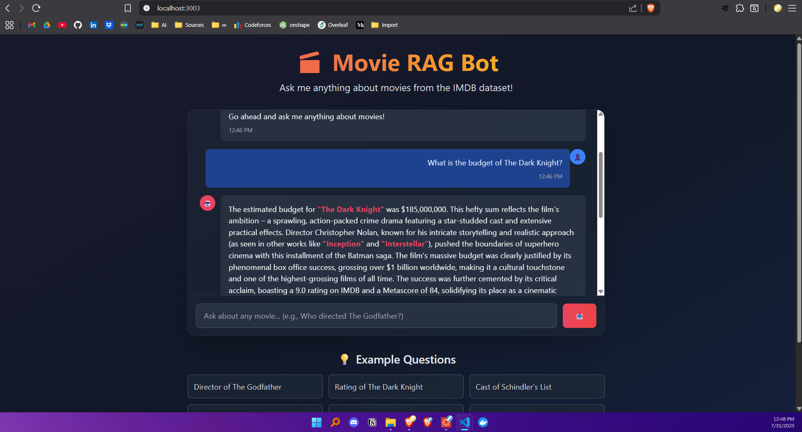

# 🎬 Movie RAG Bot with LLM

An intelligent movie information chatbot that combines **Retrieval Augmented Generation (RAG)** with **Large Language Model** integration to provide conversational, detailed answers about movies from an IMDB dataset.



## ✨ Features

- 🤖 **AI-Powered Responses**: Google Gemini LLM for intelligent, conversational answers
- 🔍 **Smart Search**: Advanced fuzzy matching finds movies even with partial/misspelled titles
- 📊 **Rich Movie Database**: 4,989 movies with ratings, directors, cast, budgets, release dates, and more
- 💬 **Natural Language Processing**: Ask questions in plain English
- 🎨 **Modern UI**: Beautiful dark-themed interface built with Tailwind CSS
- ⚡ **Fast & Accurate**: Instant responses with contextual information
- 🧠 **Context Awareness**: Understands complex queries and provides detailed explanations

## 🎯 What Makes This Special?

Unlike simple database queries, this RAG bot:
- **Understands context** and provides rich, detailed explanations
- **Handles complex questions** like "Compare Christopher Nolan movies"
- **Gives conversational responses** instead of robotic answers
- **Provides background information** about movies, directors, and cultural impact
- **Learns from context** to give more relevant answers

## 🚀 Quick Start

1. **Clone or download the project**

2. **Set up environment variables:**
   ```bash
   # Copy the example environment file
   cp .env.example .env
   
   # Edit .env and add your Gemini API key
   # Get your free API key from: https://makersuite.google.com/app/apikey
   ```

3. **Install dependencies:**
   ```bash
   npm install
   ```

4. **Start the server:**
   ```bash
   npm start
   ```

5. **Open your browser and visit:**
   ```
   http://localhost:3001
   ```

## 💬 Example Conversations

### Simple Questions (Enhanced with AI Context):

**You:** "Who is the director of The Godfather?"

**Bot:** "The Godfather was directed by Francis Ford Coppola. This 1972 masterpiece is widely regarded as one of the greatest films ever made, showcasing Coppola's exceptional direction in adapting Mario Puzo's novel. The film features iconic performances from Marlon Brando and Al Pacino, and its influence on cinema and popular culture is immeasurable."

### Complex Analysis:

**You:** "What's the rating of The Dark Knight?"

**Bot:** "The Dark Knight has an exceptional average rating of 9.0 with a Metascore of 84. Released in 2008, Christopher Nolan's masterpiece revolutionized the superhero genre with its dark, realistic approach. The film's success was largely due to Heath Ledger's haunting portrayal of the Joker, which earned him a posthumous Academy Award."

### Comparative Queries:

**You:** "Compare the budgets of Christopher Nolan movies"

**Bot:** Provides detailed analysis of multiple Nolan films with budget comparisons and box office performance.

## 🛠️ Technology Stack

- **Backend**: Node.js + Express.js
- **AI/LLM**: Google Gemini API
- **Search**: Fuse.js for fuzzy matching
- **NLP**: Natural.js for text processing  
- **Frontend**: HTML5 + Tailwind CSS + Vanilla JavaScript
- **Data**: CSV parsing with 4,989 IMDB movies

## 📊 Dataset

The bot includes comprehensive information about 4,989 movies:
- Title, Director, Writer, Cast
- IMDb Rating, Metascore
- Release Date, Country, Languages
- Budget, Worldwide Gross, Runtime

## 🎨 Interface Features

- **Dark Theme**: Professional movie-inspired design
- **Real-time Chat**: Instant responses with typing indicators
- **Example Queries**: Quick-start buttons for common questions
- **Responsive Design**: Works perfectly on desktop and mobile
- **Connection Status**: Shows API connectivity status
- **Message History**: Maintains conversation context

## 🔧 Configuration

The bot uses Google Gemini API for LLM capabilities. Configuration is managed through environment variables:

1. **Copy the environment template:**
   ```bash
   cp .env.example .env
   ```

2. **Add your API key to `.env`:**
   ```env
   GEMINI_API_KEY=your_actual_api_key_here
   GEMINI_MODEL=gemini-1.5-flash
   PORT=3001
   ```

3. **Get your free Gemini API key:**
   - Visit [Google AI Studio](https://makersuite.google.com/app/apikey)
   - Sign in with your Google account
   - Create a new API key
   - Copy it to your `.env` file

The API key is securely stored in environment variables and never committed to version control.

## 📁 Project Structure

```
RAG_bot_js/
├── server.js               # Main server with LLM integration
├── package.json            # Dependencies and scripts
├── .env                    # Environment variables (not in git)
├── .env.example           # Environment template
├── .gitignore             # Git ignore rules
├── IMDB_Movies_Dataset.csv # Movie database (4,989 movies)
├── Screenshots/            # Interface screenshots
│   └── movie_bot.png      # Main interface image
└── public/
    ├── index.html         # Tailwind CSS interface
    └── script.js          # Frontend JavaScript
```

## 🚀 Available Commands

```bash
npm start        # Start the production server
npm run dev      # Start development server with auto-reload
npm install      # Install all dependencies
```

## 🎭 Query Examples to Try

### Basic Information:
- "Who directed The Godfather?"
- "What's the rating of Inception?"
- "When was The Dark Knight released?"
- "Who are the actors in Pulp Fiction?"

### Advanced Queries:
- "Tell me about Christopher Nolan movies"
- "Which movie has the highest budget in the database?"
- "Compare the ratings of The Godfather trilogy"
- "What are some highly-rated sci-fi movies?"

### Creative Questions:
- "Movies with the best budget-to-earnings ratio"
- "Tell me about movies from the 1990s"
- "Which directors have the most movies in the database?"

## 🌟 Key Benefits

1. **Intelligent Responses**: Not just data retrieval, but contextual analysis
2. **Natural Conversations**: Ask follow-up questions naturally
3. **Rich Context**: Background information and cultural significance
4. **Error Handling**: Smart suggestions when movies aren't found
5. **Scalable Architecture**: Easy to extend with more data sources

## 🔮 Future Enhancements

- Voice input/output capabilities
- Movie recommendation system
- Integration with streaming platforms
- Multi-language support
- Advanced analytics and insights

## 📄 License

MIT License - Feel free to use this project for learning and development!

---

**Built with ❤️ using Node.js, Google Gemini AI, and Modern Web Technologies**

*Transform your movie database into an intelligent conversational assistant!*
